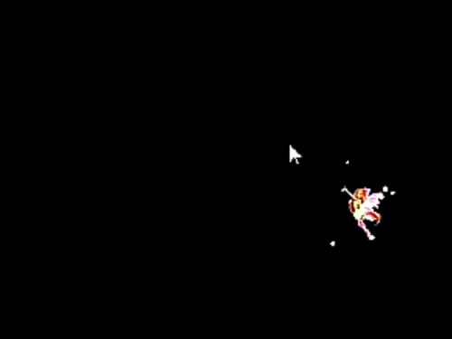

# ✨ Animated Cursor Overlay

<p align="center">
  
</p>

<p align="center">
  🖱 Smooth • ✨ Customizable • ⚡ Lightweight
</p>

---

## 🚀 Overview

A lightweight and customizable animated cursor companion built with Python.

This project creates a smooth, floating visual that follows your mouse in real-time, adding subtle visual feedback and personality to your desktop.

---

## 🎯 Features

* 🖱 Smooth cursor tracking (interpolated movement)
* 🎨 Custom image support
* ✨ Sparkle particle system
* 🌊 Floating idle animation
* 🪟 Transparent overlay window
* ⚡ Real-time performance

---

## 🧠 How It Works

This is **not a cursor replacement**, but an **overlay system**.

It works by:

* Tracking your mouse position via `pyautogui`
* Rendering a transparent window using `tkinter`
* Smoothly animating an image toward the cursor
* Adding optional visual effects (sparkles)

---

## 📁 Project Structure

```
cursor-overlay/
├── main.py          # Main loop & rendering
├── config.py        # Settings & customization
├── assets/          # Images
│   └── default.png
├── core/            # Animation systems
├── utils/           # Helpers
```

---

## ⚙️ Installation

```bash
git clone https://github.com/Sena-Demirci/cursor-overlay.git
cd cursor-overlay
pip install -r requirements.txt
```

---

## ▶️ Run

```bash
python main.py
```

Press `ESC` to exit.

---

## 🎨 Custom Image

1. Add image to `assets/`
2. Open `config.py`
3. Edit:

```python
AVAILABLE_SKINS = {
    "default": "assets/your_image.png"
}
```

---

## ⚙️ Customization

Edit `config.py`:

```python
ENABLE_SPARKLES = True
FOLLOW_SPEED = 0.18
FLOAT_STRENGTH = 2
```

---

## ✨ Disable Sparkles

```python
ENABLE_SPARKLES = False
```

---

## 🛠 Tech Stack

* Python
* Tkinter
* Pillow
* PyAutoGUI

---

## 📌 Notes

* Windows recommended
* Python 3.10+
* Use small images (<256px)

---

## ⭐ Why This Project

This project demonstrates:

* Real-time animation systems
* Modular architecture
* User-configurable design
* Overlay rendering techniques

---

## 🤝 Contributing

Pull requests are welcome.

---

> ⚠️ **NOTE**
>
> To run the project, make sure you execute the correct entry point:
>
> ```bash
> python main.py
> ```
>
> Running other files directly may cause errors due to project structure and dependencies.


## 📜 License

MIT License

Copyright (c) 2026 Sena Demirci

Permission is hereby granted...
